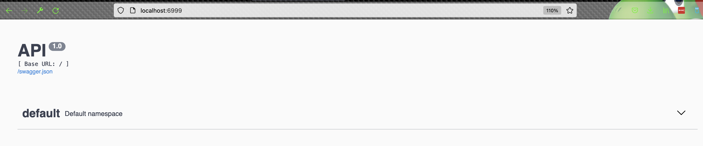
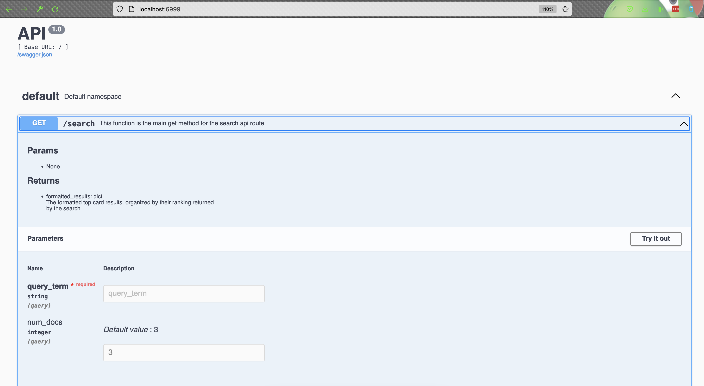
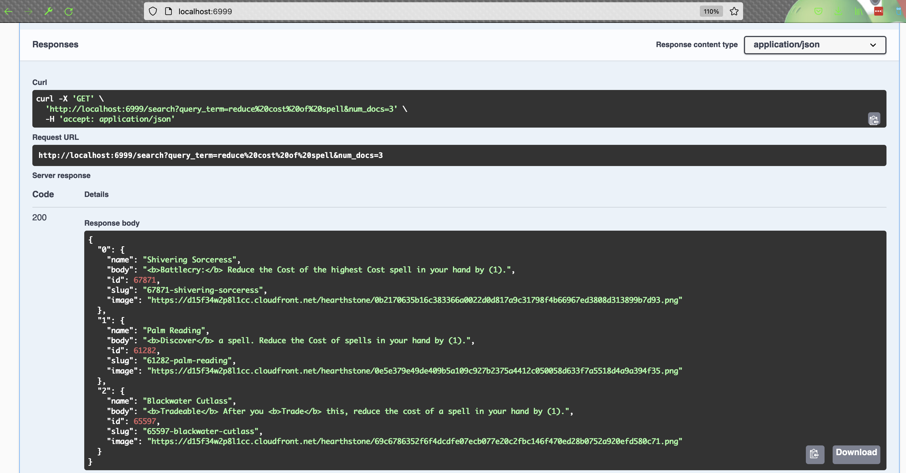
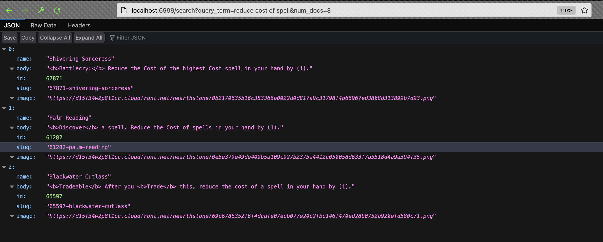
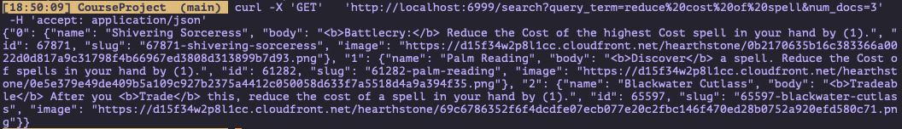

# CS 410 Course Project Documentation
Author: Ryan Baker (NetId: rtb2) [rtb2@illinois.edu](rtb2@illinois.edu)

---

This repo is the final project for Ryan Baker for CS 410, Fall 2021 at the University of Illinois at Urbana-Champaign.

*Note for reviewers:* All documentation and reports for this project are found in the `docs` directory within this repo. This includes the
project proposal, progress report, and final project documentation.

## Overview
The purpose of this project is to provide a search engine for [Hearthstone](https://playhearthstone.com/en-us) cards
powered by information retrieval methods provided by [Metapy](https://github.com/meta-toolkit/metapy). Hearthstone is a
popular online card game created by Blizzard Entertainment. The in-game search capabilities can sometimes be cumbersome
to use to find cards based on arbitrary search query terms, and this project aims to provide an alternative search
capability for the game, particularly for players building out decks of cards and browsing their collections. This
application performs pre-processing of the card data so that titles, spell schools, minion types, and classes are
included in the search rather than just searching based on the main body text of the card.

A common use case would be for a player who is building a deck from someone else, such as an online source, needs to
replace a few cards from the deck that the player doesn't own. In this case, they may want to search for specific cards
that will synergize well with the rest of the cards in the deck. To do this, a user could pick a search term, such as
"reduce cost of spell" and provide that query to the search engine in this application, which would then provide the
user with the most relevant cards.

## Implementation Details
The implementation of this application includes the following pieces: scripts for interacting with the Hearthstone game
[API](https://develop.battle.net/documentation/hearthstone/game-data-apis) provided by Blizzard Entertainment, `sqlite3`
database for caching hearthstone card data, `BeautifulSoup` text data pre-processing, `metapy` information retrieval
and search engine setup, `flask` application setup with Swagger docs, and `gunicorn` for application deployment and
serving. All code files include module and function doc strings that provide further details. All commands listed below
assume that the commands are being executed from the repo root directory.

### Hearthstone API
The data for this application consists entirely of Hearthstone game data, which is available via the Hearthstone game
data API (linked above). This repo includes a script `utils/fetch_cards.py` that interacts with the Hearthstone game
data API to obtain all necessary card info. Interactions with the API require authentication via a Blizzard developer
account, which makes it possible to obtain OAuth ids and secrets to be used with the script for authentication. The
script sends requests to two endpoints, namely the cards endpoint and the metadata endpoint. It gathers information
from all available Hearthstone cards and joins those with metadata to form a final list of cards and all relevant text
based metadata. This script can be run as follows:

```
python -m utils.fetch_cards --oauth-client-id <id> --oauth-client-secret <secret>
```

### Sqlite3 DB Data Storage
For the purposes of this application, a full integration with the Hearthstone API as part of the application deployment
is not provided. Rather, a Sqlite3 database (DB) is used to cache the results of the Hearthstone API queries for later
consumption. The script `utils/create_card_db.py` creates a new DB or connects to an existing DB and then utilizes the
`utils/fetch_cards.py` script to interact with the Hearthstone API insert the result row by row into the DB. This script
can be run as follows:

```
python -m utils.create_card_db --oauth-client-id <id> --oauth-client-secret <secret>
  --db-file cards.db
```
with an optional flag of `--existing-db` if the DB file already exists.

### BeautifulSoup Text Processing
Once the Sqlite3 database has been populated with the card data, a final script `utils/clean_text.py` utilizes a tool
called BeautifulSoup to read the card data and perform pre-processing, such as removing HTML tags and combining separate
fields, to form a set of final "documents" in the information retrieval sense that can be used for the search engine.
This script assumes the existence of a `config.toml` file that specifies details about the use of Metapy (see the next
section for more detail) including information about the "dataset". These documents and their metadata are written to
files in the dataset directory. In this case, the dataset directory is the `hearthstone/` directory. See the
`config.toml` file for more details. This script can be run as follows:

```
python -m utils.clean_text --db-file cards.db --config-file config.toml
```

### Metapy Information Retrieval Search Engine
The `metapy` python wrapper around the information retrieval `meta-toolkit` library is the main workhorse of this
application. Once the dataset is available (see previous step implementation details) and the config is specified,
a search engine can easily be setup with all Hearthstone cards. This involves creating an inverted index based on the
data and then creating a ranker that can be used to score different documents in the index. This implementation uses
the BM25 ranking method to retrieve documents (e.g. cards). An example search is provided in the script
`search-example.py`. This can be executed as follows:

```
python search-example.py --config-file config.toml --query-term "reduce cost of spell"
```
or any other query term of choice. This repo includes a pre-build index, but if a refreshed index is desired, you can
execute the following and then re-execute the search script:

```
rm -rf idx/
```

### Flask Application Setup
In order to provide an interface for users to interact with this application, the main search capabilities have been
wrapped in a simple flask app. This defines simple API endpoints that the users can interact with. This application
only has one main endpoint, which is search GET endpoint that performs a search as described previously using metapy.
The flask implementation includes built in Swagger style docs that can be accessed at the root of the application for
easy interactions (see Usage instructions below). The flask implementation does rely on a single environment variable
`METAPY_CONFIG` to specify the path to the metapy config file (e.g. `config.toml`). The implementation of the flask app
is found in `hearth-search.py`.

### Gunicorn Application Deployment and Serving
While flask provides an easy way to implement API endpoints that meet the needs of this project, it doesn't provide a
production-ready way to deploy and serve this application. So, gunicorn is utilized to meet those needs. In order to
deploy this application locally using gunicorn, simply run

```
METAPY_CONFIG=config.toml gunicorn hearth-search:app
```
A `gunicorn.conf.py` file is provided to supply gunicorn configuration. This will serve the app at
`http://127.0.0.1:6999` (see Usage instructions below for more details).

### Evaluation
An evaluation of this project was conducted using user relevance judgements. Two different hearthstone
players performed a series of queries against this application and then recorded relevance judgements for each result
returned by the search engine. This was completed using the script `evaluation.py`. It can be run as follows:

```
python evaluation.py --config-file config.toml --num-queries 10 --num-docs 10
  --output-file relevance.json
```
where the user can specify the metapy config file, number of queries, the number of search results, and the output file.
This creates an output file that contains each query, the results returned, and a relevance judgement from the user for
each result.

These relevance judgements are then fed into another script, `evaluation-summary.py` that computes the average precision
for each query. This script can be executed as follows:

```
python evaluation-summary.py --relevance-file relevance.json
```
This will then print out the average precision for each query.

The actual relevance judgements for this evaluation are stored in the `relevance/` directory in this repo. The average
precision results are displayed below.

|          | User 1 | User 2 |
|----------|--------|--------|
| Query 1  | 0.608  | 1.0    |
| Query 2  | 1.0    | 0.9    |
| Query 3  | 1.0    | 1.0    |
| Query 4  | 1.0    | 1.0    |
| Query 5  | 0.639  | 1.0    |
| Query 6  | 0.9    | 0.556  |
| Query 7  | 1.0    | 1.0    |
| Query 8  | 0.707  | 1.0    |
| Query 9  | 1.0    | 1.0    |
| Query 10 | 0.745  | 1.0    |

### Possible Extensions
There a number of immediate improvements that could be made to this application. These are described below.

#### Application Integration with Hearthstone API
For the sake of simplicity, this application does not provide a "live" integration with the Hearthstone API. Doing so
would require awareness of security concerns and contractual agreements with the use of the Hearthstone API, including
additional implementation details for deploying the model. However, it would be convenient in a full-scale deployment
of this application to provide a "live" interaction with the Hearthstone API or some other method for otherwise
"refreshing" the card data.

#### API Options
This application provides a pretty minimal API for users. This could easily be extended, with some additional work with
respect to fetching and storing card data, to include the ability to filter or sort based on card class, cost or other
attributes. In the case of a "refreshing" mechanism with the Hearthstone API (described above), an additional endpoint
could be created to trigger a refresh. This could also include the ability for a user to input a deck code and
automatically search cards with the intent to add cards to the deck and output a new deck code that could be copied
into the Hearthstone app to actually create the deck in-game.

#### User Interface
While this application meets the need of a user to be able to query for different cards, it would not be very usable at
a large scale. In order to be more user-friendly, it would be necessary to create a user interface (UI) for the
application that could display the actual cards returned by the search. This would provide users with a really easy way
to view all search results. Depending on the API extensions (described above), the UI could also provide a user with
the ability to browse their current deck while they search for new cards to add to the deck.

## Usage

### Installation/Setup
The following installation and setup instructions assume a python environment with python version 3.6.10. Metapy may not
work the same with different versions of python. In order to use a clean python environment, consider using `pyenv` with
`virtualenv`. A tutorial can be found [here](https://realpython.com/intro-to-pyenv/).

Once a working python environment is available, please clone this repo. Examples are below with both HTTP and SSH.

```
git clone https://github.com/rtb-illinois/CourseProject.git
```
OR
```
git clone git@github.com:rtb-illinois/CourseProject.git
```

Once the repo has been cloned, please installed all required dependencies as follows:

```
pip install -r requirements.txt
```

Once all the dependencies have been installed, the application can be run with the following command:

```
METAPY_CONFIG=config.toml gunicorn hearth-search:app
```

At this point, the application will be running at `http://127.0.0.1:6999`.

### Query Examples

#### Swagger Docs
Swagger docs are a convenient way to interact with APIs. To access the swagger docs, navigate to `http://127.0.0.1:6999`
once the application is running (see the installation instructions above). This will take you directly to the swagger
page. At this point, you can click on the namespace (there's only one namespace) and then the specific route (there's
only one route). Then there is a button `Try it Out` that will allow you to give inputs, and then press the `Execute`
button. This will send a request to the application and return the result. See figures 1-3 for screenshot examples.







#### Browser
Once the application is running, a user can send requests to the application directly via the browser, by pasting a URL
such as the following into the browser: [](http://localhost:6999/search?query_term=reduce%20cost%20of%20spell&num_docs=3)
The query part of the URL may be replaced by any query term and number of documents, but keep in mind that it must be
properly URL encoded. This can be accomplished using a URL encoder online, such as [this one](https://www.urlencoder.org/).
See figure 4 for screenshot example.



#### Command Line (e.g. curl)
Once the application is running, you can send requests to the API via [curl](https://curl.se/) or another command line
tool for sending data via URLs. To use curl, you can send a request as follows:

```
curl -X 'GET' \
  'http://localhost:6999/search?query_term=reduce%20cost%20of%20spell&num_docs=3' \
  -H 'accept: application/json'
```
The query part of the URL may be replaced by any query term and number of documents, but keep in mind that it must be
properly URL encoded. This can be accomplished using a URL encoder online, such as [this one](https://www.urlencoder.org/).
See figure 5 for screenshot example.


